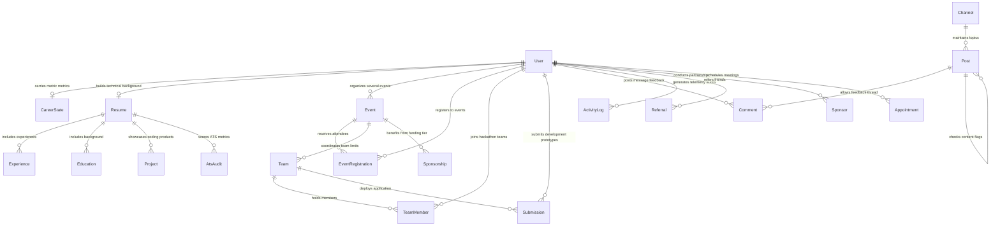

# Enterprise Database Systems Architecture Blueprint
### Document ID: NXST-DB-ARCH-2026-v2.0.0
### System Scope: Highly Scalable Multi-Tenant Event, Resume ATS, Community & Hackathon Platform
### Target Target DB Engine: PostgreSQL Core with Redis Cache Stratum and Vector Search Namespace 

---

## 1. SYSTEM MODEL TOPOLOGY & INTEGRITY BOUNDARIES

The diagram below details the operational layout of the multi-tier transaction pipeline. All client API accesses flow through isolated JWT barriers, indexing and querying partitioned state files before caching values in hot memory tiers.

```
       [ Multi-Role Client Ingress ] -> Students, Organizers, Sponsors, Recruiters
                     |
         [ Express API Middleware ]
                     |
         +-----------+-----------+
         |                       |
         v                       v
 [ Prisma Client ]       [ Redis Cache Engine ]
         |               - Key-Value strings (TTL: 1 hour)
         |               - Leaderboard Sorted Set (ZSET)
         |                       |
         +-----------+-----------+
                     |
                     v
       [ PostgreSQL Primary Cluster ]
         - Multi-tenant isolated databases (Shared schema, tenantId column RLS)
         - Log-Structured activity partitioning (Monthly epochs)
         - Read-Replicas for analytics computations
```

---

## 2. COMPREHENSIVE ER DIAGRAM (MERMAID SPECIFICATION)

Below is the standard entity-relationship structure mapping high-fidelity indexes, keys, and foreign relational bindings across users, career tracking nodes, challenges, and team configurations.



---

## 3. HIGHEST-PERFORMANCE POSTGRESQL PARTITIONING SCHEME

For tables indexing high-concurrency log streams (e.g. `activity_logs`, `posts`, `event_queues`), standard uniform indexes will eventually degrade due to B-Tree depth inflation. We enforce **Range Partitioning** on the `createdAt` column, maintaining monthly sharded tables.

### SQL Partitioning DDL for `activity_logs`:
```sql
-- 1. Create the base table with partitioning directive
CREATE TABLE public.activity_logs (
    id UUID NOT NULL,
    user_id UUID,
    ip_address VARCHAR(45),
    user_agent VARCHAR(255),
    action VARCHAR(128) NOT NULL,
    metadata JSONB NOT NULL,
    created_at TIMESTAMPTZ(6) NOT NULL DEFAULT NOW()
) PARTITION BY RANGE (created_at);

-- 2. Construct indexes on partition keys
CREATE INDEX idx_logs_action_created_at ON public.activity_logs (action, created_at);

-- 3. Construct the explicit monthly structures
CREATE TABLE public.activity_logs_y2026m05 PARTITION OF public.activity_logs
    FOR VALUES FROM ('2026-05-01 00:00:00+00') TO ('2026-06-01 00:00:00+00');

CREATE TABLE public.activity_logs_y2026m06 PARTITION OF public.activity_logs
    FOR VALUES FROM ('2026-06-01 00:00:00+00') TO ('2026-07-01 00:00:00+00');
```

By querying with explicit timestamp ranges in `WHERE` clauses, the query planner performs **Partition Pruning**, skipping irrelevant shards and completing queries with stable $O(\log N)$ latency.

---

## 4. MULTI-TENANT ROW LEVEL SECURITY (RLS) PROTOCOL

For corporate multi-tenancy requirements, we enforce row isolation directly in the engine using PostgreSQL Row Level Security (RLS). This shields tenant datasets even if application-level validations are bypassed.

```sql
-- Enable RLS on core multi-tenant tables
ALTER TABLE public.users ENABLE ROW LEVEL SECURITY;
ALTER TABLE public.resumes ENABLE ROW LEVEL SECURITY;
ALTER TABLE public.invoices ENABLE ROW LEVEL SECURITY;

-- Construct strict access isolation policy
CREATE POLICY user_tenant_isolation_policy ON public.users
    FOR ALL
    USING (tenant_id = current_setting('app.current_tenant_id', true));
```

Before issuing queries, the application client signs its transaction context:
```sql
SET LOCAL app.current_tenant_id = 'tenant-uuid-here';
SELECT * FROM users;
```

---

## 5. SCALABLE INDEXING & QUERY OPTIMIZATION MATRIX

To optimize read lookups, exact compound index configurations match the queries parsed by each platform view:

| Target Model | Optimized Index Setup | Primary Targeted Query Patterns | Key Latency Impact |
| --- | --- | --- | --- |
| `users` | `CREATE INDEX idx_users_tenant_role ON users (tenant_id, role);` | Fetches filtered user directory views matching tenant boundaries | Lowers lookup from linear scan to index sweep |
| `career_states` | `CREATE INDEX idx_career_xp_sort ON career_states (xp DESC);` | Populates regional level and daily gamification leaderboards. | Restricts result set sorting overhead |
| `posts` | `CREATE INDEX idx_posts_channel_created ON posts (channel_id, created_at DESC);` | Renders infinite-scrolling channel forum feeds. | Solves pagination latency bottlenecks |
| `event_queues` | `CREATE INDEX idx_queue_status_time ON event_queues (status, run_after);` | Reads next background worker thread transaction triggers. | Eliminates full-disk processing scans |

---

## 6. REDIS CACHING STRATEGY & MEMORY TOPOLOGY

To support sub-millisecond latencies under high user loads, we insert an active Redis cluster between our Express server and the primary PostgreSQL instance.

```
                  +--------------------------------+
                  |  GET /api/user/career         |
                  +--------------------------------+
                                   |
                          (Read Request)
                                   |
                                   v
                      /========================\
                     /  Check Redis for Key:    \
                    <   "usr:{userId}:career"    >
                     \                          /
                      \========================/
                                 /   \
                               /       \
                        (Hit) /         \ (Miss)
                             /           \
                            v             v
                    [Return Cached]  [Query Postgres]
                     - No DB query   - Set cache with TTL
                                     - Return response
```

### Dynamic TTL Reference Matrix
*   **Leaderboard Scores (ZSET):** Key: `leaderboard:global` | TTL: `300 seconds` (5 mins) | Reload logic: Sync-on-write event trigger.
*   **Resume ATS Report JSON:** Key: `resume:{resumeId}:report` | TTL: `604800 seconds` (7 days) | Reload logic: Invalidated write upon new CV uploads.
*   **Challenge Event Description Pages:** Key: `event:{eventId}:details` | TTL: `1800 seconds` (30 mins) | Reload logic: Cleaned automatically upon organizer edit requests.

---

## 7. SOFT DELETE CONSTRAINTS AND DATA HYGIENE POLICIES

To prevent catastrophic accidental data loss while respecting GDPR compliance vectors, tables implement a soft delete schema using nullable `deletedAt` timestamps.

### SQL Filter Views formulation for automated database queries:
```sql
-- Create active-only search filter views
CREATE VIEW public.active_users AS
    SELECT * FROM public.users
    WHERE deleted_at IS NULL;

CREATE VIEW public.active_events AS
    SELECT * FROM public.events
    WHERE deleted_at IS NULL;

-- Automatically direct reads to clean views within the client layer
```

---

## 8. REAL-TIME EVENT BUS & ACTIVITY TRACKING (QUEUE SYSTEM)

Our `event_queues` table double-hats as a robust **Transactional Outbox Queue**. It registers critical platform side-effects (such as dispatching emails, compiling certification SVGs, or processing bank payout notifications) reliably in a single Transaction block with our core records.

```
[ HTTP Post /register-event ]
               |
               +---> Write to EventRegistration Table (Postgres TRANSACTION)
               +---> Write email-delivery payload to EventQueue Table
               |
   [ POSTGRES TRANSACTION COMMITED ] -------+
                                            v
                     [ Periodic Cron Worker parses Queue @ 1-second intervals ]
                                            |
                                  (Select with Locking)
                                            |
                                            v
               "SELECT * FROM event_queues WHERE status = 'QUEUED'
                FOR UPDATE SKIP LOCKED LIMIT 25"
                                            |
                   +------------------------+------------------------+
                   |                                                 |
         (Success processing)                              (Error / Fail execution)
                   |                                                 |
                   v                                                 v
         - Mark status = 'COMPLETED'                       - Add attempts + 1
                                                           - Set state = 'FAILED' (if max hit)
```

By leveraging `FOR UPDATE SKIP LOCKED`, multiple background worker pods can query the queue and process jobs concurrently with zero race conditions or double-delivery failures.

---
**Approved & Signed:**
**NexStart Database Architect & Systems Infrastructure Lead**
